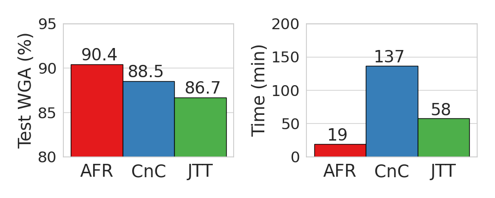

# Automatic Feature Reweighting (AFR)
This repository contains the code for the paper
[_Simple and Fast Group Robustness by Automatic Feature Reweighting_](https://openreview.net/pdf?id=s5F1a6s1HS)
by Shikai Qiu, Andres Potapczynski, Pavel Izmailov and Andrew Gordon Wilson (ICML 2023).

## Introduction

Robustness to spurious correlations is of foundational importance for the reliable deployment of machine learning systems in the real-world,
where it is common that deep learning models fail to generalize on unusual examples and minority groups in the data.
Standard methods for reducing the reliance on spurious features typically assume that we know what the spurious feature is, which is rarely true in the real world. Methods that attempt to alleviate this limitation are complex, hard to tune, and lead to a significant computational overhead compared to standard training.
To address these limitations, we propose _Automatic Feature Reweighting_ (AFR), a simple method that is easy to implement, does not require group annotations on the training data or manual intervention from experts, and is computationally cheap to run and tune.


<figure>
  
  <figcaption>(Left) Test worst-group accuracy and (right) training time comparison on Waterbirds for state-of-the-art methods that do not use group information during training.
   AFR outperforms the baselines, while only requiring a small fraction of compute time.</figcaption>
</figure>

<br>
<br>

AFR achieves **state-of-the-art results** across a wide variety of benchmarks **without requiring group labels through training**, and with **fast training times** that are only marginally longer than standard ERM.
We summarize the worst group accuracy achieved by AFR and competing methods on benchmark datasets in the table below.

| Method     | Waterbirds   | CelebA   | MultiNLI     | CivilComments | Chest X-Ray  |
|------------|--------------|----------|--------------|---------------|--------------|
| ERM        | 72.6         | 47.2     | 67.9         | 57.4          | 4.4          |
| JTT        | 86.7         | 81.1     | 72.6         | 69.3          | 52.3         |
| CNC        | 88.5±0.3     | 88.8±0.9 | -            | 68.9±2.1      | -            |
| AFR (Ours) | **90.4±1.1** | 82.0±0.5 | **73.4±0.6** | 68.7±0.6      | **56.0±3.4** |

## Citation
If you find AFR useful, please cite our work:
```bibtex
@article{qiu2023afr,
    title={{Simple and Fast Group Robustness by Automatic Feature Reweighting}},
    author={Shikai Qiu and Andres Potapczynski and Pavel Izmailov and Andrew Gordon Wilson},
    journal={International Conference on Machine Learning (ICML)},
    year={2023}
}
```

## Installation and Requirements
Simply clone the repo and install the requirements by sourcing `scripts/requirements.sh`.
We opted for having the requirements in a bash script rather than the usual formats
to make it easier to see and install the version of PyTorch that we used in the project.
The most important requirements are:
* `PyTorch`. ML framework used in the project.
* `transformers`. To load language models used for text benchmarks.
* `timm`. To load vision models used for image benchmarks.
* `wandb`. To perform logging and hyperparameter sweeps.

It is also required that you have access to the datasets that you want to run as
benchmarks.

## File Structure
```
.
├── data --> groups several utils for loading dataset and augmentations
│   ├── augmix_transforms.py
│   ├── dataloaders.py
│   ├── datasets.py --> contains the base clases for managing the datasets and groups
│   ├── data_transforms.py
│   ├── __init__.py
├── logs --> where experimental results get saved
├── losses --> comprises the loss functions used
│   └── __init__.py
├── models --> incorporates all the model definitions used in the experiments
│   ├── __init__.py  --> most model definitions
│   ├── model_utils.py
│   ├── preresnet.py
│   └── text_models.py
├── optimizers --> has the optimizers used in the experiments
│   └── __init__.py
├── notebooks --> provides easy-to-use notebooks for running AFR on Waterbirds, CelebA, MultiNLI, and CivilComments
│   ├── wb_celeba.ipynb
│   ├── multnli.ipynb
│   └── civil.ipynb
├── README.md
├── scripts
│   └── requirements.sh
├── setup.cfg --> yapf linter settings used in the project
├── train_embeddings.py --> main script to train from embeddings (second stage)
├── train_supervised.py --> main script used to run checkpoints (first stage)
└── utils --> utils to run experiments, log results and track metrics
    ├── common_utils.py
    ├── general.py
    ├── __init__.py
    ├── logging.py
    ├── logging_utils.py
    └── supervised_utils.py
```
## Running AFR
We now show the command line arguments for running AFR's first and
second stage. We explain the arguments in detail after each command. We also provide notebook implementations of AFR's second stage that take care of hyperparameter tuning and provide special support for MultiNLI and CivilComments due to different models and data formats. See "Running AFR in a Notebook". 
### First Stage
Using waterbirds as an example, for the first stage run
```shell
ARCH='imagenet_resnet50_pretrained'
DATA_DIR='/datasets/waterbirds_official'
SEED=21
PROP=80
OMP_NUM_THREADS=4 python3 train_supervised.py \
    --output_dir=logs/waterbirds/${PROP}_${SEED} \
    --project=waterbirds \
    --seed=${SEED} \
    --eval_freq=10 \
    --save_freq=10 \
    --data_dir=${DATA_DIR} \
    --data_transform=AugWaterbirdsCelebATransform \
    --model=${ARCH} \
    --train_prop=${PROP} \
    --num_epochs=50 \
    --batch_size=32 \
    --optimizer=sgd_optimizer \
    --scheduler=constant_lr_scheduler \
    --init_lr=0.003 \
    --weight_decay=1e-4
```
| Name | Description |
| :------------ |  :-----------: |
| `output_dir` | Specifies where the results are saved. |
| `project` | Name of the wandb project. |
| `seed` | Seed to use. |
| `eval_freq` | How often (in epochs) to evaluate the current model on the validation set. |
| `save_freq` | How often (in epochs) to save a model checkpoint. |
| `data_dir` | File path where the dataset is located. |
| `data_transform` | Type of augmentation being used. |
| `model` | Model architecture. |
| `train_prop` | % of train dataset to use for the 1st stage. |
| `num_epochs` | Number of epochs to run. |
| `batch_size` | Size of the mini-batches. |
| `optimizer` | Type of optimizer to use. |
| `scheduler` | Type of scheduler to use. |
| `init_lr` | Initial learning rate (starting point for the scheduler). |
| `weight_decay` | Weight decay value. |

### Second Stage
To run the second stage in our waterbirds example use the following command
```shell
python3 train_embeddings.py \
--use_wandb \
--output_dir=logs/waterbirds/emb \
--project=waterbirds \
--seed=0 \
--base_model_dir=<first_stage_checkpoint_dir> \
--model=imagenet_resnet50_pretrained \
--data_dir=/datasets/waterbirds_official \
--data_transform=NoAugWaterbirdsCelebATransform \
--num_augs=1 \
--num_epochs=500 \
--batch_size=128 \
--emb_batch_size=-1 \
--optimizer=sgd_optimizer \
--scheduler=constant_lr_scheduler \
--init_lr=0.01 \
--momentum=0. \
--weight_decay=0. \
--grad_norm=1.0 \
--loss=afr \
--tune_on=train \
--train_prop=-20 \
--gamma=<afr_gamma> \
--reg_coeff=<afr_lambda>
```
| Name | Description |
| :------------ |  :-----------: |
| `use_wandb` | use wandb for logging (remove this flag if not using). |
| `output_dir` | Specifies where the results are saved. |
| `project` | Name of the wandb project. |
| `seed` | Seed to use. |
| `base_model_dir` | Location of the first stage checkpoint. |
| `model` | Model architecture. |
| `data_dir` | File path where the dataset is located. |
| `data_transform` | Type of augmentation being used to compute embeddings. |
| `num_augs` | Number of augmentations to use for embeddings. |
| `num_epochs` | Number of epochs to run. |
| `batch_size` | Size of the mini-batches for computing embeddings. |
| `optimizer` | Type of optimizer to use. |
| `scheduler` | Type of scheduler to use. |
| `init_lr` | Initial learning rate (starting point for the scheduler). |
| `weight_decay` | Weight decay value (should be 0). |
| `loss` | Name of loss function to be used (should be afr). |
| `train_prop` | % of train dataset use for 2nd stage (-x% means the last x%). |
| `gamma` | $\gamma$ in AFR. |
| `reg_coeff` | $\lambda$ in AFR for $\ell_2$ regularization to first stage checkpoint. |
| `grad_norm` | Gradient norm cap (shouldb be 1). |


## Examples

### Waterbirds
```shell
# 1st stage
python3 train_supervised.py --use_wandb --output_dir=logs/waterbirds/80_0 --project=waterbirds --seed=0 --eval_freq=10 --save_freq=10 --data_dir='/datasets/waterbirds_official' --dataset=SpuriousDataset --data_transform=AugWaterbirdsCelebATransform --model='imagenet_resnet50_pretrained' --max_prop=1.0 --train_prop=80 --num_epochs=50 --batch_size=32 --optimizer=sgd_optimizer --scheduler=constant_lr_scheduler --init_lr=0.003 --weight_decay=1e-4
# 2nd stage
python3 train_embeddings.py --use_wandb --output_dir=logs/waterbirds/emb --project=waterbirds --seed=0 --base_model_dir=logs/waterbirds/80_0 --model=imagenet_resnet50_pretrained --data_dir=/datasets/waterbirds_official --data_transform=NoAugWaterbirdsCelebATransform --num_epochs=500 --batch_size=128 --emb_batch_size=-1 --optimizer=sgd_optimizer --scheduler=constant_lr_scheduler --init_lr=0.01 --momentum=0. --weight_decay=0. --loss=afr --tune_on=train --train_prop=-20 --gamma=10 --num_augs=1 --grad_norm=1.0 --reg_coeff=0.0
```
### CelebA
```shell
# 1st stage
python3 train_supervised.py --use_wandb --output_dir=logs/celeba/80_1 --project=celeba --seed=1 --eval_freq=10 --save_freq=10 --data_dir='/datasets/CelebA' --data_transform=AugWaterbirdsCelebATransform --model='imagenet_resnet50_pretrained' --max_prop=1.0 --train_prop=80 --num_epochs=20 --batch_size=100 --optimizer=sgd_optimizer --scheduler=cosine_lr_scheduler --init_lr=3e-3 --weight_decay=1e-4
# 2nd stage
python3 train_embeddings.py --use_wandb --output_dir=logs/celeba/emb --project=celeba --seed=0 --base_model_dir=logs/celeba/80_1 --model='imagenet_resnet50_pretrained' --data_dir='/datasets/CelebA' --data_transform=NoAugWaterbirdsCelebATransform --num_epochs=1000 --batch_size=128 --emb_batch_size=-1 --optimizer=sgd_optimizer --scheduler=constant_lr_scheduler --init_lr=0.02 --momentum=0.0 --weight_decay=0. --loss=afr --tune_on=train --train_prop=-0.2 --gamma=1.44 --num_augs=1 --grad_norm=1.0 --reg_coeff=0.001 --checkpoint=final_checkpoint.pt
```

### CivilComments
```shell
# 1st stage
OMP_NUM_THREADS=4 python3 wilds_exps/run_expt.py --dataset civilcomments --algorithm ERM --root_dir /data/users/pavel_i/datasets/ --log_dir 'logs/bert_civilcomments_dfrdrop_2/' --seed 2 --dfr_reweighting_seed 2 --dfr_reweighting_drop --dfr_reweighting_frac 0.2 --model bert-base-uncased
# 2nd stage to be run in the notebook
```

### MultiNLI
```shell
# 1st stage
OMP_NUM_THREADS=4 python3 gdro_fork/run_expt.py -s confounder -d MultiNLI -t gold_label_random -c sentence2_has_negation --lr 2e-05 --batch_size 32 --weight_decay 0 --model bert --n_epochs 3 --seed 1 --log_dir=logs/multinli/erm_dfrdrop1 --root_dir=/data/users/pavel_i/datasets/multinli/ --dfr_reweighting_drop --dfr_reweighting_seed=1 --dfr_reweighting_frac=0.2 --save_last --save_best
# 2nd stage to be run in the notebook
```

## Running AFR in a Notebook
To facilitate reproducing results in the paper, the `notebooks` directory provide easy-to-use notebooks with self-contained code to run and tune AFR on Waterbirds, CelebA, MultiNLI, and CivilComments. You only need to modify a few path variables to use your own model checkpoints. Those variables can be located by searching for `TODO`. Separate notebooks exist for MultiNLI and CivilComments because they use models and data formats different from Waterbirds and CelebA that are not natively supported in our code base.

## Data Access

### Waterbirds and CelebA

Please follow the instructions in the [DFR repo](https://github.com/PolinaKirichenko/deep_feature_reweighting#data-access) to prepare the Waterbirds and CelebA datasets.

### CivilComments

For CivilComments, we use the version of the dataset natively available in the [WILDS package](https://wilds.stanford.edu/datasets/#civilcomments).

We use the standard [WILDS ERM training scrtipts](https://github.com/p-lambda/wilds/tree/main#using-the-example-scripts) to train models on this dataset. 

### MultiNLI

To run experiments on the MultiNLI dataset, manually download and unzip the dataset from [this link](https://nlp.stanford.edu/data/dro/multinli_bert_features.tar.gz).
Then copy the `dataset_files/utils_glue.py` to the root directory of the dataset.

We train models on CivilComments using the code available in the [spurious_feature_learning](https://github.com/izmailovpavel/spurious_feature_learning).

### Chest X-Ray

The chest X-ray data that we used combines two sources: [CheXpert](https://stanfordmlgroup.github.io/competitions/chexpert/) 
and [NIH](https://www.kaggle.com/datasets/nih-chest-xrays/data/code).
Please place both datasets on the same folder. Our dataloader is expecting a `chexpert`
folder containing the CheXpert data and a `nihcxr` folder containing the NIH data.
